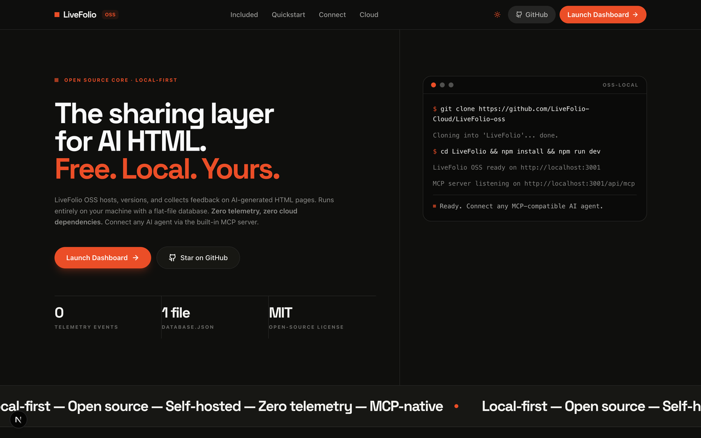
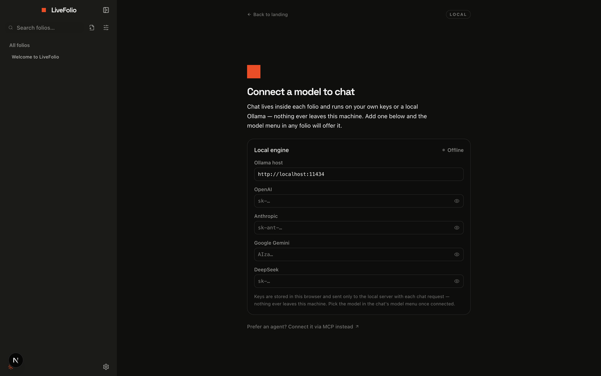
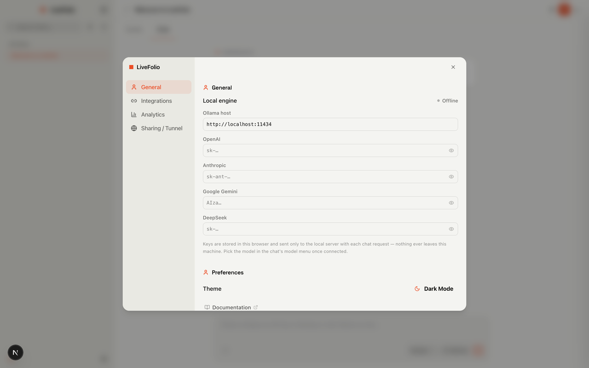
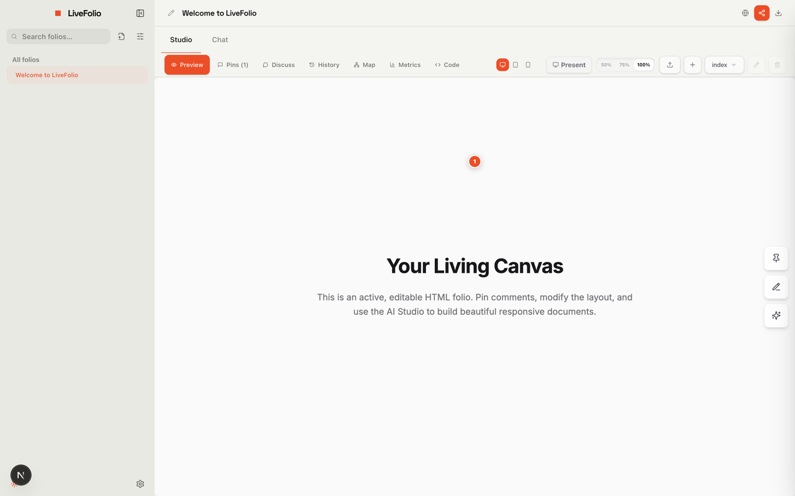
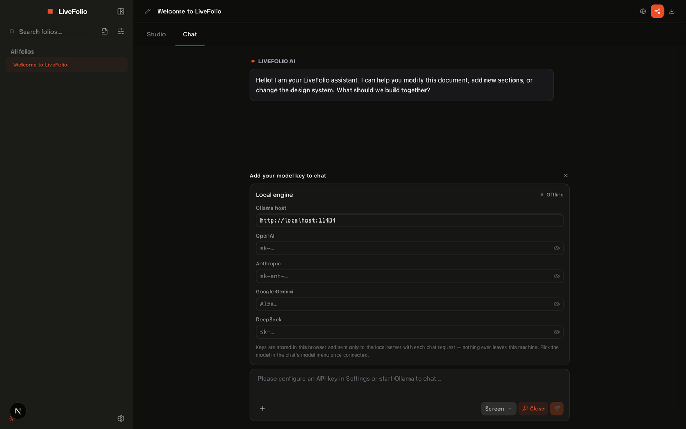
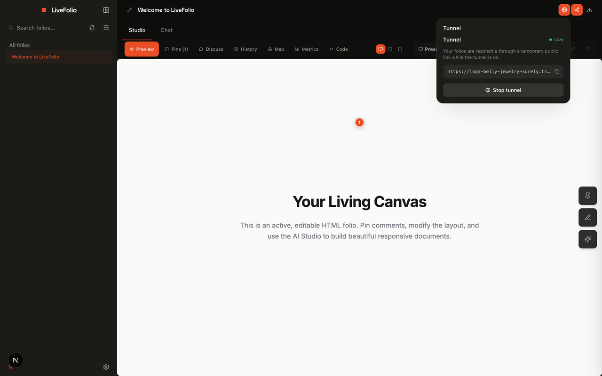
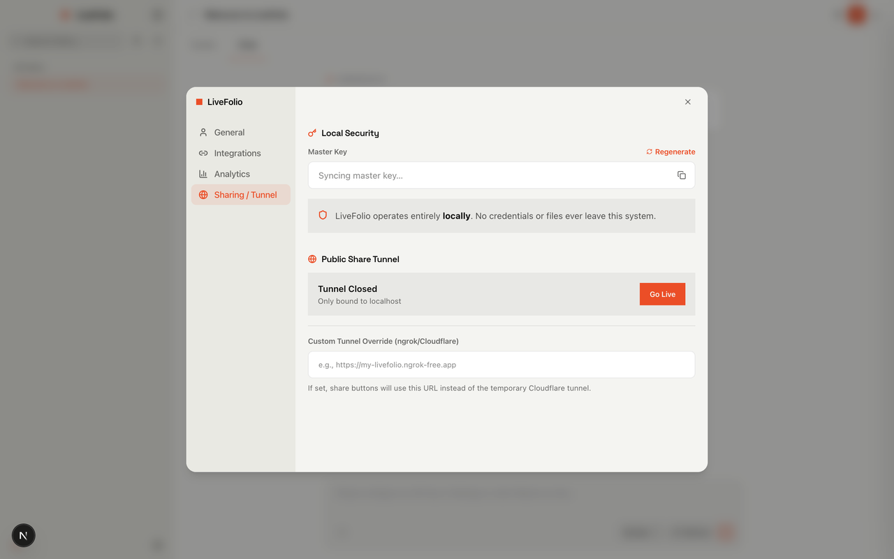
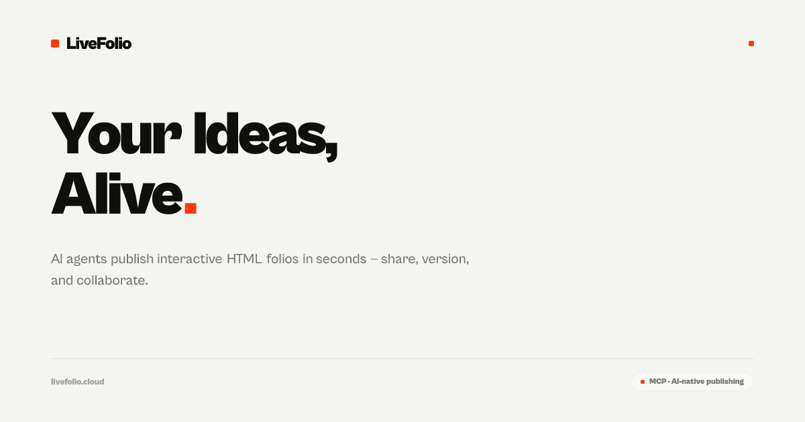

# LiveFolio OSS

**The sharing layer for AI-generated HTML. Free. Local. Yours.**

AI models are great at producing interactive HTML — decks, dashboards,
documents, data stories — but the result usually dies as a file. LiveFolio is
the missing host-and-share layer for those artifacts: a local-first server
that versions every change, renders folios in a safe sandbox, collects
pin-point feedback, and publishes them to the web through an on-demand
tunnel. Your agents publish through the built-in **MCP server**; people view,
react, and comment through a share link.

Everything runs on your machine: a single `database.json`, your own AI keys
(or a local Ollama), zero accounts, zero telemetry.

[](assets/screenshots/landing-hero.png)

---

## Quickstart

Requires **Node.js 20+**. No database, no Docker, no `.env` — nothing.

```bash
npm install
npm run dev
```

Open **[http://localhost:3001](http://localhost:3001)** (port 3001 is pinned
so LiveFolio can sit next to your other dev servers).

### First run — connect a model

The dashboard asks for a model before anything else: paste an API key
(OpenAI · Anthropic · Gemini · DeepSeek) or point at a local **Ollama**.
Keys live in your browser and travel only to the local server — nothing
leaves your machine.

[](assets/screenshots/connect-model.png)

Change or rotate keys any time in **Settings → General**:

[](assets/screenshots/settings-byok.png)

### Create, edit, and chat with AI

Create a folio from the sidebar (**+ New folio** — blank, upload, or
template) or let an agent publish one over MCP. Open it and switch to the
**Chat** tab: the model menu offers everything you connected, and the
assistant edits your actual files through tool calls — each change lands as
a new version you can diff and restore.

[](assets/screenshots/studio.png)

No model connected yet? The chat asks for the key itself — the model slot
becomes the shortcut:

[](assets/screenshots/chat-byok.png)

### Go live in one click

Hit the globe in the folio header → **Go live** opens a Cloudflare Quick
Tunnel and gives you a share link for anyone on the web. Drafts stay private
until you flip **Public link** on.

[](assets/screenshots/tunnel-live.png)

Settings → **Sharing / Tunnel** shows your master key, tunnel state, and an
optional custom-domain override (ngrok / your own Cloudflare hostname):

[](assets/screenshots/tunnel-settings.png)

---

## What you can do

- **Version every change** — every manual save or AI edit creates a named
  checkpoint; compare and restore from the version rail.
- **Chat-edit your folios (BYOK)** — your keys, your machine: edit, restyle,
  add or delete pages, apply a design system, export. Providers with native
  function-calling do the full tool loop.
- **Publish and share** — on-demand tunnel, public links, comments and
  reactions from guests, all stored locally.
- **Collect precise feedback** — reviewers pin comments directly on the
  rendered page; those pins compile into a structured design brief your
  agent can read and act on.
- **Design systems included** — 140+ portable specs in `design-systems/`,
  applicable from the chat.
- **Agent-native** — your Claude Code / Cursor / any MCP client reads and
  writes your library over the local MCP server.

---

## Connect an AI agent (MCP)

LiveFolio exposes a Model Context Protocol server (SSE + JSON-RPC 2.0) at:

```
http://localhost:3001/api/mcp
```

```json
{
  "mcpServers": {
    "livefolio": {
      "url": "http://localhost:3001/api/mcp"
    }
  }
}
```

Your agent can then work with your library directly:

| Tool | What it does |
| :--- | :--- |
| `list_projects` / `get_project` | Browse folios and pull full source + version history |
| `create_project` / `update_project` | Publish a new folio or push changed files as a new version |
| `delete_project` | Remove a folio |
| `get_curated_brief` | Compile all open review pins into a markdown brief |
| `get_active_design_system` | Fetch a folio's colors, type scale, and layout rules |
| `add_comment` / `add_reaction` / `moderate_comment` | Leave and clean up feedback on a folio |
| `get_sharing_status` / `toggle_sharing_tunnel` | Check and control the public tunnel from chat |
| `set_folio_public_access` | Flip a folio between private draft and public link |

The master key from **Settings → Sharing & Tunnel** authenticates agent
access; regenerate it any time. (Marketplace, paid access, teams, and seller
tools exist in LiveFolio Cloud — they're hidden in OSS.)

---

## Privacy posture

- All folios, versions, comments, and settings live in `database.json` in
  the working directory — back up by copying that one file.
- AI keys are stored in your browser's `localStorage` and used only by the
  local server for your requests.
- The app phones home **never** — no analytics, no tracking. The only
  outbound paths are the tunnel you switch on yourself and the model
  endpoints you configure.
- With the tunnel off, everything is reachable only from your machine.

---

## Repository layout

```
app/                 Next.js routes — /app workspace, /share viewer, /api/*
components/          Studio, chat, share, and app-shell UI
lib/                 flat-file DB (lib/db.ts), env, AI providers, app shell
design-systems/      140+ portable design specs (DESIGN.md each)
assets/screenshots/  README images
server.ts            Production entry (node server.ts after npm run build)
```

**How this repo is maintained:** LiveFolio development happens in the private
Cloud repository; this tree receives synchronized, sanitized releases (the
sync contract — what ships and what's excluded — lives in `bin/sync-oss.js`).
PRs and issues are welcome and are folded back upstream.

---

## Need more than local?

Everything above runs on your machine, forever, for free. When you want your
work to reach people — and to earn from it — **LiveFolio Cloud** is the hosted
edition of the same product.

### Get discovered in Explore

Publishing locally means sharing a link. Publishing on Cloud means being
**found**. Every folio you make public can be listed in **Explore** — the
marketplace where people browse, preview, and buy interactive HTML that
others have built. Your work gets a home page, a profile, and an audience
instead of a URL that lives in a chat thread.

- List folios publicly with a one-step listing consent
- Get reactions, comments, and follower counts on your profile
- Rank and surface by what people actually open

### Sell your folios

Turn any folio into a product without leaving the editor. Set a price, gate
the content, and get paid — the same folio you built locally, sold from a
hosted page that handles delivery and access for you.

- **Paid access** — one-time purchase, per folio or per workspace
- **Paywall and preview** — first-page preview, blurred gate, or timed trial
- **Stripe Connect** — connect your account and receive payouts directly
- **Earnings dashboard** — sales, net earnings, and per-folio revenue
- **Buyer licenses** — clear terms, with copy/duplication controls you set

### Plus the team layer

Team workspaces and roles, Slack/Discord connectors, custom domains,
per-viewer analytics, and managed hosting that scales past your laptop.

Same MCP protocol end to end — your agents and workflows move over with zero
migration.

[](https://livefolio.cloud)

**→ [livefolio.cloud](https://livefolio.cloud)** — start free, explore what
others are building, and publish your first paid folio.

---

## License

[AGPL-3.0](LICENSE) · [Contributing](CONTRIBUTING.md) ·
[Code of Conduct](CODE_OF_CONDUCT.md) · [Security](SECURITY.md)
